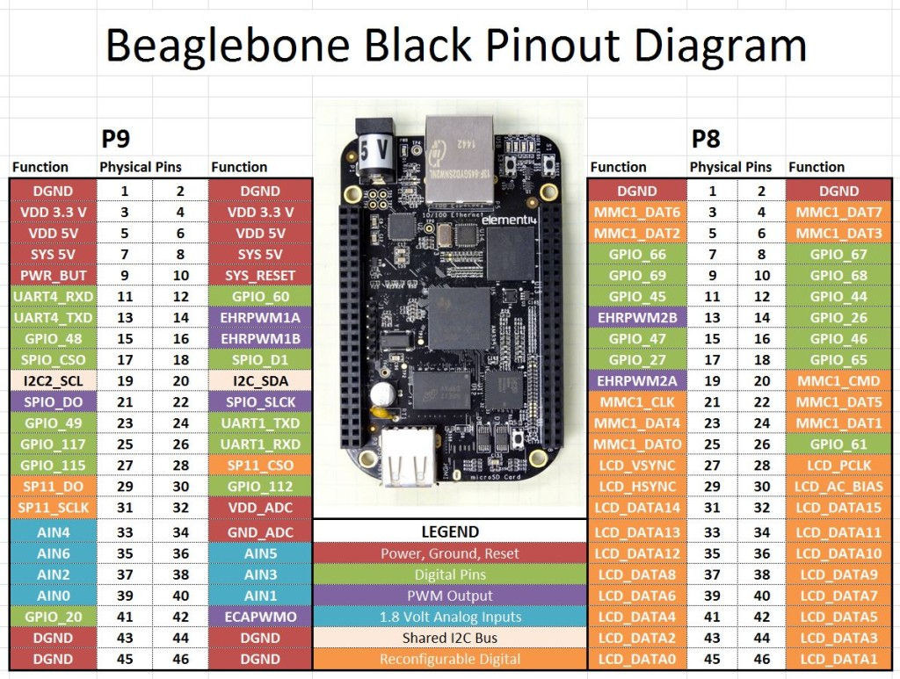

This folder contains all of the setup information for the BBB. Device tree overlays, pinout information, kernal modules, and a script to set everything up.

# How to apply settings
1. Copy over all `.dts` files to the BBB using `scp`
2. Copy over the `initOverlay` script to the BBB   
3. Run the `./initOverlay` script. This must be in the same directory as the `.dts` files. Change the permissions of this file if necessary

# BBB setup includes: 
* CAN Bus device tree overlay and kernal module setup
  * [Reference here](https://electronics.stackexchange.com/questions/195416/beaglebone-black-can-bus-setup)
  * Device tree _and_ kernal modules will be needed. Likely additional can utils will need to be installed.
  * Run `ifconfig` to see if can0 shows up. The device will need to be connected before anything will show up.
* ADC input device tree overlay setup
  * [Reference here](https://www.teachmemicro.com/beaglebone-black-adc/)
  * Look in the `/sys/bus/iio/devices/iio:device0` folder for ADC values
* PWM output device tree overlay setup
  * [Reference here](https://www.teachmemicro.com/beaglebone-black-pwm-ubuntu-device-tree/)
  * Look in the `/sys/class/pwm/pwmchip0/pwm0/` folder for the ability to write to PWM
  * The above was setup following instructions in the reference guide.
* GPIO input for PRU, for Optical inputs, device tree overlay setup
  * Great guide on setting the PRUSS (Programmable Real-time Unit Sub System). [Derek Molloy's site](http://exploringbeaglebone.com/chapter13/)
  * (elinux guide)[https://elinux.org/EBC\_Exercise\_30\_PRU\_via\_remoteproc\_and\_RPMsg]
  * (TI's walk through guide)[http://processors.wiki.ti.com/index.php/PRU\_Training:_Hands-on_Labs]
  * The PRU Header files necessary for development with their IDE are included in this repo. They were found [here](http://www.ti.com/tool/PROCESSOR-SDK-AM335X). Pretty confusing, but it was in the "PROCESSOR\_SDK\_LINUX\_AM335X", once installed it was in some example files for the PRU.
  * [Best reference](https://elinux.org/images/d/da/Am335xPruReferenceGuide.pdf) I could find explaining all of the nitty-gritty details of the PRU. 
  * (Another developer blog with links)[https://ianrrees.github.io/2016/11/20/getting-started-with-beaglebone-pru-programming-the-new-way.html]
  * [Device-Tree Overlay Generator](http://www.kilobaser.com/blog/2014-07-28-beaglebone-black-devicetreeoverlay-generator). 
* GPIO output device tree overlay setup
  * [Derek Molloy's site](http://derekmolloy.ie/gpios-on-the-beaglebone-black-using-device-tree-overlays/). Goes through how to install the device tree, and most importently how to initialize the GPIO once it has been setup in the device tree.
  * Check `/sys/class/gpio/` 
  * [Device-Tree Overlay Generator](http://www.kilobaser.com/blog/2014-07-28-beaglebone-black-devicetreeoverlay-generator). 
* One-Wire communication protocol for DS18B20 temperature sensor device tree overlay
  * [Reference here](http://www.bonebrews.com/temperature-monitoring-with-the-ds18b20-on-a-beaglebone-black/).
  * Check the comments, there are syntax errors. There is a missing `;` on line 37.
  * Run `cat /sys/bus/w1/devices/28-*/w1_slave` to get the temperature, multiplied by 1000.
* I2C is already enabled by default by the kernal. On I2C2 bus.
* View all device trees on BBB: `dtc -f -I fs /proc/device-tree | less `

# Pin reference
* The two PDFs in this directory contain detailed information about each header. 
* CAN Bus 
  * P9-24 (CAN RX) and P9-26 (CAN TX).
* ADC 
  * P9-33 through P9-40
* PWM
  * P9-14 (EHRPWM1A) or P9-16 (EHRPWM1B)
* GPIO input for PRU, Optical sensors
  * P8-27 through P8-29, and P8-39 through P8-46
* GPIO output 
  * P8-7 through P8-10
* DS18B20 temperature sensors
  * P8-11 (and optionally P8-12)
* I2C2
  * P9-19 and P9-20
* 

